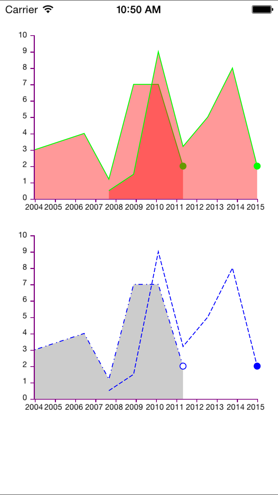

# MBXGraphs

[](https://travis-ci.org/tamarabernad/MBXGraphs)
[](http://cocoadocs.org/docsets/MBXGraphs)
[](http://cocoadocs.org/docsets/MBXGraphs)
[](http://cocoadocs.org/docsets/MBXGraphs)

MBXGraphs is a library to display one or more line graphs in a chart, with several displaying options (fill, no fill, dashed line, end-marker, etc.). The library also takes care about the XY axes, being able to customize them and displaying nice and distributed intervals.

It can be used with nib files as well as by code created views.

####Features:
The type of distribution on the axes can be chosen, there are two options

* MBXLineGraphDataSourceAxisCalcValueDistribute
Distributes the axes values taking into consideration the values gotten from the data.

* MBXLineGraphDataSourceAxisCalcEquallyDistribute
Distributes the axes values evenly throughout the view, not taking into consideration the values. Good for logarithmic distributed axes.

The distribution of tickmarks can be chosen on the axes
* MBXLineGraphDataSourceAxisCalcAutoTickmark
Automatically calculates the best and "nicest" distribution and values to show on the axes. Gives somes space at the beginning and at the end to make the graph look nicer. Good for Y axes values.

* MBXLineGraphDataSourceAxisCalcValueTickmark
Uses the exact values from the data set as tickmarks and values to shw on the axes. Good for X axes values.




## Usage

To run the example project, clone the repo, and run `pod install` from the Example directory first.

## Installation

MBXGraphs is available through [CocoaPods](http://cocoapods.org/?q=MBXGraphs). To install
it, simply add the following line to your Podfile:

    pod "MBXGraphs"

## Code Example

```objectivec
#import "MBXViewController.h"
#import "MBXLineGraphDataSource.h"
#import "MBXGraphView.h"
#import "MBXGraphAxisView.h"

#import "MBXChartVM.h"

@interface MBXViewController ()<MBXGraphDelegate, MBXGraphAxisDelegate>
@property (weak, nonatomic) IBOutlet MBXGraphView *viewGraph;
@property (weak, nonatomic) IBOutlet MBXGraphAxisView *viewYAxis;
@property (weak, nonatomic) IBOutlet MBXGraphAxisView *viewXAxis;

@property (nonatomic, strong) MBXLineGraphDataSource *dataSourceNib;
@property (nonatomic, strong) MBXLineGraphDataSource *dataSourceCode;


@property (nonatomic, strong) MBXGraphView *viewGraphCode;
@property (nonatomic, strong) MBXGraphAxisView *viewYAxisCode;
@property (nonatomic, strong) MBXGraphAxisView *viewXAxisCode;

@end

@implementation MBXViewController

////////////////////////////////////
#pragma mark - Actions
////////////////////////////////////
- (IBAction)onChangeValuesclick:(id)sender {
    [self setRandomValuesForAllDataSources];
    [self reload];
}
////////////////////////////////////
#pragma mark - Lazy getters
////////////////////////////////////
- (MBXGraphAxisView *)viewXAxisCode{
    if(!_viewXAxisCode){
        _viewXAxisCode = [MBXGraphAxisView new];
        [_viewXAxisCode setDirection:kDirectionHorizontal];
    }
    return _viewXAxisCode;
}
- (MBXGraphAxisView *)viewYAxisCode{
    if(!_viewYAxisCode){
        _viewYAxisCode = [MBXGraphAxisView new];
        [_viewYAxisCode setDirection:kDirectionVertical];
    }
    return _viewYAxisCode;
}
- (MBXGraphView *)viewGraphCode{
    if(!_viewGraphCode){
        _viewGraphCode = [MBXGraphView new];
    }
    return _viewGraphCode;
}
- (MBXLineGraphDataSource *)dataSourceNib{
    if(!_dataSourceNib){
        _dataSourceNib = [MBXLineGraphDataSource new];
    }
    return _dataSourceNib;
}
- (MBXLineGraphDataSource *)dataSourceCode{
    if(!_dataSourceCode){
        _dataSourceCode = [MBXLineGraphDataSource new];
    }
    return _dataSourceCode;
}

////////////////////////////////////
#pragma mark - Life cycle
////////////////////////////////////
- (void)viewDidLoad
{
    [super viewDidLoad];
    
    // nib created graph
    self.viewGraph.dataSource = self.dataSourceNib;
    self.viewYAxis.dataSource = self.dataSourceNib;
    self.viewXAxis.dataSource = self.dataSourceNib;
    
    self.viewXAxis.direction = kDirectionHorizontal;
    self.viewYAxis.direction = kDirectionVertical;

    self.viewGraph.delegate = self;
    self.viewXAxis.delegate = self;
    self.viewYAxis.delegate = self;

    // code created graph
    [self.view addSubview:self.viewGraphCode];
    [self.view addSubview:self.viewYAxisCode];
    [self.view addSubview:self.viewXAxisCode];
    
    self.viewYAxisCode.frame = CGRectMake(0, 270, 40, 188);
    self.viewXAxisCode.frame = CGRectMake(40, 458, 256, 40);
    self.viewGraphCode.frame = CGRectMake(40, 270, 256, 188);

    self.viewGraphCode.dataSource = self.dataSourceCode;
    self.viewYAxisCode.dataSource = self.dataSourceCode;
    self.viewXAxisCode.dataSource = self.dataSourceCode;
    
    self.viewGraphCode.delegate = self;
    self.viewYAxisCode.delegate = self;
    self.viewXAxisCode.delegate = self;

    self.dataSourceNib.xAxisCalc = MBXLineGraphDataSourceAxisCalcValueTickmark | MBXLineGraphDataSourceAxisCalcValueDistribute;
    self.dataSourceNib.yAxisCalc = MBXLineGraphDataSourceAxisCalcAutoTickmark | MBXLineGraphDataSourceAxisCalcValueDistribute;
    
    self.dataSourceCode.xAxisCalc = MBXLineGraphDataSourceAxisCalcValueTickmark | MBXLineGraphDataSourceAxisCalcEquallyDistribute;
    self.dataSourceCode.yAxisCalc = MBXLineGraphDataSourceAxisCalcAutoTickmark | MBXLineGraphDataSourceAxisCalcValueDistribute;
    
    [self setRandomValuesForAllDataSources];
}
- (void)viewDidAppear:(BOOL)animated{
    [self reload];

}
- (void)didRotateFromInterfaceOrientation:(UIInterfaceOrientation)fromInterfaceOrientation{
    [self reload];
}
////////////////////////////////////
#pragma mark - MBXLineGraphDelegate
////////////////////////////////////
- (void)MBXLineGraphView:(MBXGraphView *)graphView configureAppearanceGraphVM:(MBXGraphVM *)graphVM{

    if(graphView == self.viewGraph){
        graphVM.color = [UIColor greenColor];
        graphVM.drawingType =  MBXLineGraphDawingTypeLine | MBXLineGraphDawingTypeFill;
        graphVM.fillColor = [UIColor redColor];
        graphVM.fillOpacity = 0.4;
        graphVM.priority = 1000;
    }else{
        
        if([graphVM.uid isEqualToString:@"0"]){
            graphVM.color = [UIColor blueColor];
            graphVM.lineStyle = MBXLineStyleDotDash;
            graphVM.drawingType = MBXLineGraphDawingTypeLine | MBXLineGraphDawingAnimated;
        }else{
            graphVM.color = [UIColor purpleColor];
            graphVM.lineStyle = MBXLineStyleDashed;
            graphVM.drawingType = MBXLineGraphDawingTypeLine | MBXLineGraphDawingAnimated;
        }
        graphVM.priority = 1000;
        graphVM.animationDuration = 0.5f;
    }

}
- (CGSize)MBXLineGraphView:(MBXGraphView *)graphView markerSizeAtIndex:(NSInteger)index{
    return CGSizeMake(8, 8);
}
- (BOOL)MBXLineGraphView:(MBXGraphView *)graphView hasMarkerAtIndex:(NSInteger)index{
    if(self.viewGraph == graphView){
        return index == [self.dataSourceCode.chartVM getGraphByUid:@"0"].proportionPoints.count-1;
    }else{
        return YES;
    }
}
- (CALayer *)MBXLineGraphView:(MBXGraphView *)graphView markerViewForGraphVM:(MBXGraphVM *)graphVM ForPointAtIndex:(NSInteger)index{
    CALayer *marker = [CALayer layer];
    [marker setMasksToBounds:YES];
    if ([graphVM.uid isEqualToString:@"0"]) {
        [marker setBorderWidth:1.0];
        [marker setBackgroundColor:[UIColor whiteColor].CGColor];
        [marker setBorderColor:[UIColor greenColor].CGColor];
    }else{
        [marker setBackgroundColor:[UIColor greenColor].CGColor];
    }
    [marker setCornerRadius:8/2];
    return marker;
}

- (UIView *)MBXGraphAxis:(MBXGraphAxisView *)graphAxis ViewForValue:(NSNumber *)value{
    UILabel *label = [UILabel new];
    label.font =[UIFont systemFontOfSize:9];
    label.text = [value stringValue];
    [label sizeToFit];
    return label;
}
- (NSInteger)MBXGraphAxisTicksHeight:(MBXGraphAxisView *)graphAxis{
    return 1;
}
- (NSInteger)MBXGraphAxisTicksWidth:(MBXGraphAxisView *)graphAxis{
    return 4;
}
- (UIColor *)MBXGraphAxisColor:(MBXGraphAxisView *)graphAxis{
    return [UIColor purpleColor];
}

////////////////////////////////////
#pragma mark - helpers
////////////////////////////////////
- (void)reload{
    [self.viewGraph reload];
    [self.viewYAxis reload];
    [self.viewXAxis reload];
    
    [self.viewGraphCode reload];
    [self.viewYAxisCode reload];
    [self.viewXAxisCode reload];
}
- (void) setRandomValuesForAllDataSources{
    [self setRandomValuesForDataSource:self.dataSourceCode];
    [self setRandomValuesForDataSource:self.dataSourceNib];
}
- (void) setRandomValuesForDataSource:(MBXLineGraphDataSource *)dataSource{
    NSArray *graphValues = @[
                             @[@{@"y":[self rand], @"x": @125},
                               @{@"y":[self rand], @"x": @250},
                               @{@"y":[self rand], @"x": @500},
                               @{@"y":[self rand], @"x": @1000},
                               @{@"y":[self rand], @"x": @2000},
                               @{@"y":[self rand], @"x": @4000}],
                             
                             @[@{@"y":[self rand], @"x": @125},
                               @{@"y":[self rand], @"x": @250},
                               @{@"y":[self rand], @"x": @500},
                               @{@"y":[self rand], @"x": @1000},
                               @{@"y":[self rand], @"x": @2000},
                               @{@"y":[self rand], @"x": @4000}]
                             ];
    [dataSource setMultipleGraphValues:graphValues];
}
- (NSNumber *) rand{
    int max = 10;
    return [NSNumber numberWithFloat:(((float)rand() / RAND_MAX) * max)];
}
@end


```

## Author

Tamara Bernad, @tamarinda

## License

MBXGraphs is available under the MIT license. See the LICENSE file for more info.

