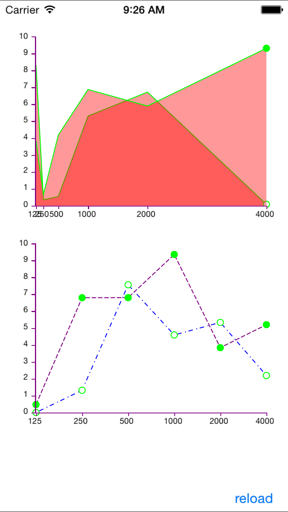

# MBXGraphs

[](https://travis-ci.org/tamarabernad/MBXGraphs)
[](http://cocoadocs.org/docsets/MBXGraphs)
[](http://cocoadocs.org/docsets/MBXGraphs)
[](http://cocoadocs.org/docsets/MBXGraphs)

MBXGraphs is a library to display one or more line graphs in a chart, with several displaying options (fill, no fill, dashed line, end-marker, etc.). The library also takes care about the XY axis, being able to customize them and displaying nice and distributed intervals.

It can be used with nib files as well as by code created views.



## Usage

To run the example project, clone the repo, and run `pod install` from the Example directory first.

## Installation

MBXGraphs is available through [CocoaPods](http://cocoapods.org/?q=MBXGraphs). To install
it, simply add the following line to your Podfile:

    pod "MBXGraphs"

## Code Example

```
#import "MBXViewController.h"
#import "MBXLineGraphDataSource.h"
#import "MBXGraphView.h"
#import "MBXGraphAxisView.h"

#import "MBXChartVM.h"

@interface MBXViewController ()<MBXGraphDelegate, MBXGraphAxisDelegate>
@property (weak, nonatomic) IBOutlet MBXGraphView *viewGraph;
@property (weak, nonatomic) IBOutlet MBXGraphAxisView *viewYAxis;
@property (weak, nonatomic) IBOutlet MBXGraphAxisView *viewXAxis;

@property (nonatomic, strong) MBXLineGraphDataSource *dataSource;


@property (nonatomic, strong) MBXGraphView *viewGraphCode;
@property (nonatomic, strong) MBXGraphAxisView *viewYAxisCode;
@property (nonatomic, strong) MBXGraphAxisView *viewXAxisCode;

@end

@implementation MBXViewController
- (IBAction)onChangeValuesclick:(id)sender {
NSArray *graphValues = @[
@[@{@"y":@0.0, @"x": @2005},
@{@"y":@0.5, @"x": @2006},
@{@"y":@0.0, @"x": @2007},
@{@"y":@0.2, @"x": @2008},
@{@"y":@0.0, @"x": @2009},
@{@"y":@0.0, @"x": @2010},
@{@"y":@0.0, @"x": @2011}],

@[@{@"y":@0.5, @"x": @2008},
@{@"y":@0.5, @"x": @2009},
@{@"y":@0.0, @"x": @2010},
@{@"y":@0.2, @"x": @2011},
@{@"y":@0.0, @"x": @2012},
@{@"y":@0.0, @"x": @2013},
@{@"y":@0.0, @"x": @2014}]
];
[self.dataSource setMultipleGraphValues:graphValues];
[self reload];
}

- (MBXGraphAxisView *)viewXAxisCode{
if(!_viewXAxisCode){
_viewXAxisCode = [MBXGraphAxisView new];
[_viewXAxisCode setDirection:kDirectionHorizontal];
}
return _viewXAxisCode;
}
- (MBXGraphAxisView *)viewYAxisCode{
if(!_viewYAxisCode){
_viewYAxisCode = [MBXGraphAxisView new];
[_viewYAxisCode setDirection:kDirectionVertical];
}
return _viewYAxisCode;
}
- (MBXGraphView *)viewGraphCode{
if(!_viewGraphCode){
_viewGraphCode = [MBXGraphView new];
}
return _viewGraphCode;
}
- (MBXLineGraphDataSource *)dataSource{
if(!_dataSource){
_dataSource = [MBXLineGraphDataSource new];
}
return _dataSource;
}
- (void)viewDidLoad
{
[super viewDidLoad];

// nib created graph
self.viewGraph.dataSource = self.dataSource;
self.viewYAxis.dataSource = self.dataSource;
self.viewXAxis.dataSource = self.dataSource;

self.viewXAxis.direction = kDirectionHorizontal;
self.viewYAxis.direction = kDirectionVertical;

self.viewGraph.delegate = self;
self.viewXAxis.delegate = self;
self.viewYAxis.delegate = self;

// code created graph
[self.view addSubview:self.viewGraphCode];
[self.view addSubview:self.viewYAxisCode];
[self.view addSubview:self.viewXAxisCode];

self.viewYAxisCode.frame = CGRectMake(0, 270, 40, 188);
self.viewXAxisCode.frame = CGRectMake(40, 458, 256, 40);
self.viewGraphCode.frame = CGRectMake(40, 270, 256, 188);

self.viewGraphCode.dataSource = self.dataSource;
self.viewYAxisCode.dataSource = self.dataSource;
self.viewXAxisCode.dataSource = self.dataSource;

self.viewGraphCode.delegate = self;
self.viewYAxisCode.delegate = self;
self.viewXAxisCode.delegate = self;


NSArray *graphValues = @[
@[@{@"y":@3.0, @"x": @2005},
@{@"y":@3.5, @"x": @2006},
@{@"y":@4.0, @"x": @2007},
@{@"y":@1.2, @"x": @2008},
@{@"y":@7.0, @"x": @2009},
@{@"y":@7.0, @"x": @2010},
@{@"y":@2.0, @"x": @2011}],

@[@{@"y":@0.5, @"x": @2008},
@{@"y":@1.5, @"x": @2009},
@{@"y":@9.0, @"x": @2010},
@{@"y":@3.2, @"x": @2011},
@{@"y":@5.0, @"x": @2012},
@{@"y":@8.0, @"x": @2013},
@{@"y":@2.0, @"x": @2014}]
];
[self.dataSource setMultipleGraphValues:graphValues];
}
- (void)viewDidAppear:(BOOL)animated{
[self reload];

}
- (void)didRotateFromInterfaceOrientation:(UIInterfaceOrientation)fromInterfaceOrientation{
[self reload];
}

- (void)reload{
[self.viewGraph reload];
[self.viewYAxis reload];
[self.viewXAxis reload];

[self.viewGraphCode reload];
[self.viewYAxisCode reload];
[self.viewXAxisCode reload];
}
- (void)MBXLineGraphView:(MBXGraphView *)graphView configureAppearanceGraphVM:(MBXGraphVM *)graphVM{

if(graphView == self.viewGraph){
graphVM.color = [UIColor greenColor];
graphVM.drawingType =  MBXLineGraphDawingTypeLine | MBXLineGraphDawingTypeFill;
graphVM.fillColor = [UIColor redColor];
graphVM.fillOpacity = 0.4;
graphVM.priority = 1000;
}else{
graphVM.color = [UIColor blueColor];
if([graphVM.uid isEqualToString:@"0"]){
graphVM.lineStyle = MBXLineStyleDotDash;
graphVM.drawingType = MBXLineGraphDawingTypeLine | MBXLineGraphDawingTypeFill | MBXLineGraphDawingAnimated;
}else{
graphVM.lineStyle = MBXLineStyleDashed;
graphVM.drawingType = MBXLineGraphDawingTypeLine | MBXLineGraphDawingAnimated;
}
graphVM.fillColor = [UIColor grayColor];
graphVM.fillOpacity = 0.4;
graphVM.priority = 1000;
graphVM.animationDuration = 0.5f;
}

}
- (CGSize)MBXLineGraphView:(MBXGraphView *)graphView markerSizeAtIndex:(NSInteger)index{
return CGSizeMake(8, 8);
}
- (BOOL)MBXLineGraphView:(MBXGraphView *)graphView hasMarkerAtIndex:(NSInteger)index{
if(self.viewGraph == graphView){
return index == [self.dataSource.chartVM getGraphByUid:@"0"].proportionPoints.count-1;
}else{
return YES;
}
}
- (CALayer *)MBXLineGraphView:(MBXGraphView *)graphView markerViewForPointAtIndex:(NSInteger)index{
CALayer *marker = [CALayer layer];
[marker setMasksToBounds:YES];
[marker setBorderWidth:1.0];
[marker setBackgroundColor:[UIColor whiteColor].CGColor];
[marker setBorderColor:[UIColor greenColor].CGColor];
[marker setCornerRadius:8/2];
return marker;
}

- (UIView *)MBXGraphAxis:(MBXGraphAxisView *)graphAxis ViewForValue:(NSNumber *)value{
UILabel *label = [UILabel new];
label.font =[UIFont systemFontOfSize:9];
label.text = [value stringValue];
[label sizeToFit];
return label;
}
- (NSInteger)MBXGraphAxisTicksHeight:(MBXGraphAxisView *)graphAxis{
return 1;
}
- (NSInteger)MBXGraphAxisTicksWidth:(MBXGraphAxisView *)graphAxis{
return 4;
}
- (UIColor *)MBXGraphAxisColor:(MBXGraphAxisView *)graphAxis{
return [UIColor purpleColor];
}
@end


```

## Author

Tamara Bernad, tamara.bernad@gmail.com

## License

MBXGraphs is available under the MIT license. See the LICENSE file for more info.

